# Server Access Recovery

## Table of Contents
- [Overview](#overview)
- [Architecture Diagram](#architecture-diagram)
- [Step-by-Step Recovery Process](#step-by-step-recovery-process)
  - [1. Identify the Problem](#1-identify-the-problem)
  - [2. Locate Original EBS Volume](#2-locate-original-ebs-volume)
  - [3. Detach the Volume from Locked Instance](#3-detach-the-volume-from-locked-instance)
  - [4. Launch a New EC2 Instance](#4-launch-a-new-ec2-instance)
  - [5. Create a New SSH Key Pair](#5-create-a-new-ssh-key-pair)
  - [6. Detach Empty Volume from New Instance](#6-detach-empty-volume-from-new-instance)
  - [7. Stop Instance to Detach Volume](#7-stop-instance-to-detach-volume)
  - [8. Delete Empty Volume](#8-delete-empty-volume)
  - [9. Attach Original Volume to New Instance](#9-attach-original-volume-to-new-instance)
  - [10. Clean Up](#10-clean-up)
  - [11. Verify Access](#11-verify-access)
- [Lessons Learned](#lessons-learned)

---

## Overview

**Problem:**  
An EC2 instance was launched **without a key pair**, and Instance Connect later failed, resulting in a total SSH lockout.  

**Solution:**  
Detached the root EBS volume from the locked-out instance, created a new instance with a key pair, reattached the original volume, and restored access successfully.  

**Outcome:**  
The server was recovered **without any data loss**.  

> **Note:** This was an actual issue with my personal portfolio server, not a simulation. I recreated the steps for documentation purposes.

---

## Architecture Diagram

  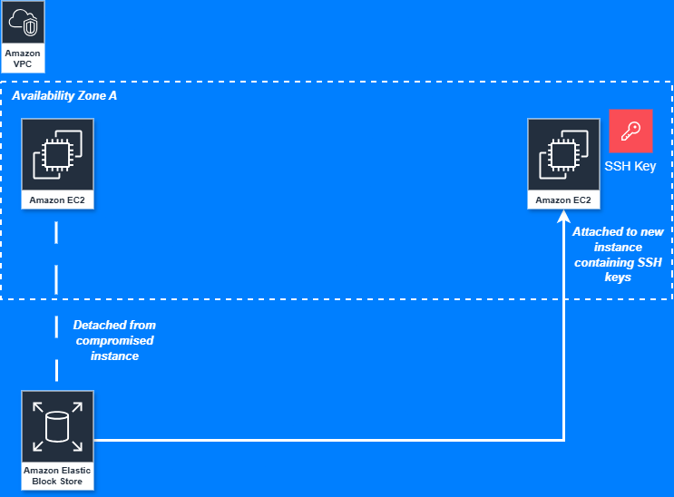 
  <em>Architecture Diagram: EC2 instance recovery process.</em>

---

## Step-by-Step Recovery Process

### 1. Identify the Problem
- The original EC2 instance was running, but SSH and Instance Connect access were not possible.  
- Navigated to **EC2 → Storage** to investigate.

  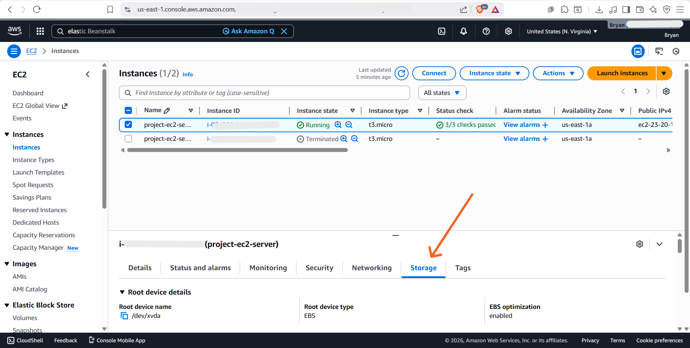 
  <em>Pic 1: EC2 instance running but inaccessible via SSH or Instance Connect.</em>

---

### 2. Locate Original EBS Volume
- Identified the **EBS volume** containing valuable website files and code.

  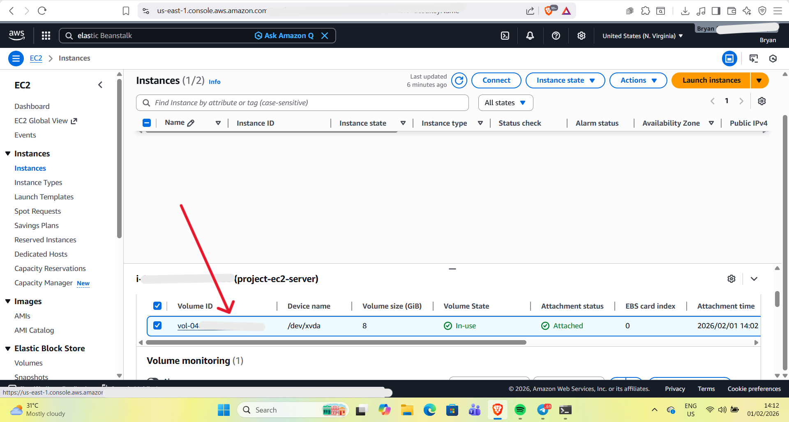 
  <em>Pic 2: Original EBS volume containing website files and code.</em>

---

### 3. Detach the Volume from Locked Instance
- Detached the root EBS volume from the inaccessible EC2 instance to prepare for recovery.

   
  <em>Pic 3: Detached root volume from the locked instance.</em>

---

### 4. Launch a New EC2 Instance in the same Availability Zone
- Created a **new instance** to regain access to the original volume. You can attach volumes to instances that are in the same Availability Zone only.

  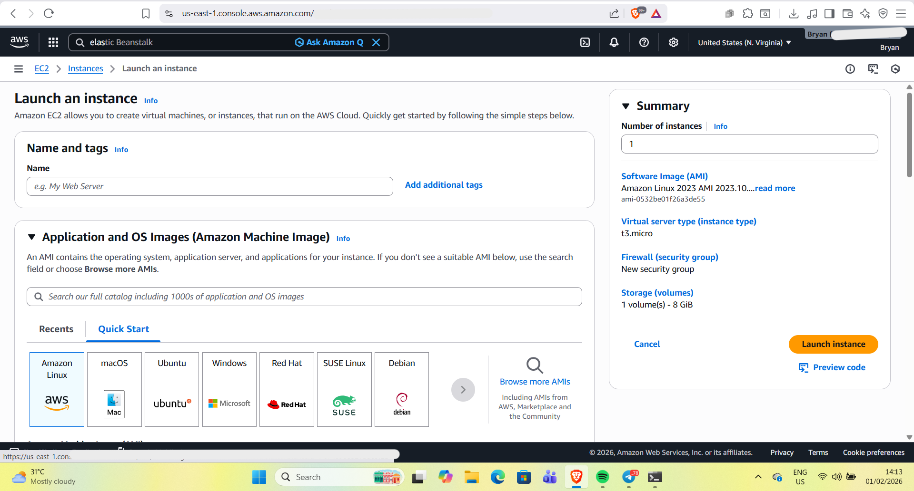 
  <em>Pic 4: Launched a new EC2 instance for recovery.</em>

---

### 5. Create a New SSH Key Pair
- During instance creation, created and selected a **new key pair**.  
- **Important:** Amazon Linux requires a key pair at instance creation; existing keys cannot be added later, which explains why SSH failed on the original instance.

  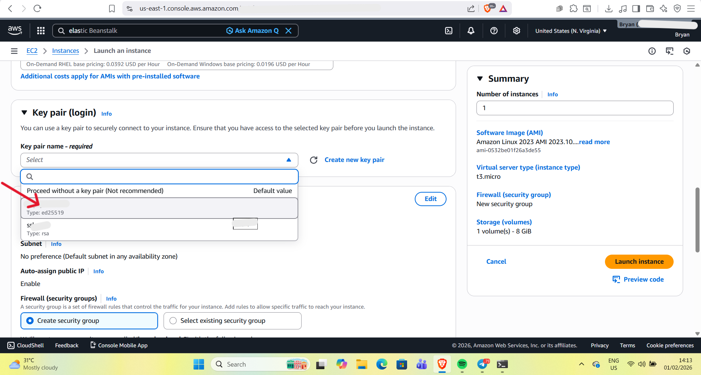 
  <em>Pic 5: New key pair created and selected during instance setup.</em>

---

### 6. Detach Empty Volume from New Instance
- Attempted to detach the default empty volume from the new instance so the original volume could be attached instead.

  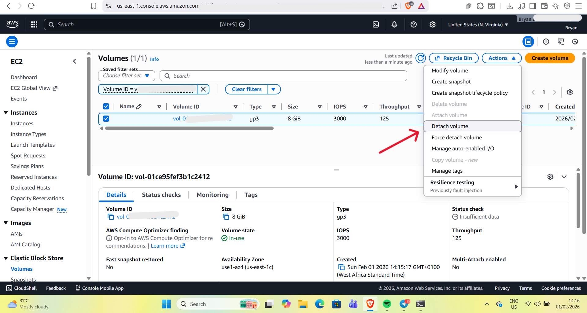 
  <em>Pic 6: Attempted to detach empty volume from the new instance.</em>

---

### 7. Stop Instance to Detach Volume
- The detach process initially failed because the instance was still running.  
- Stopped the instance to allow volume detachment.

  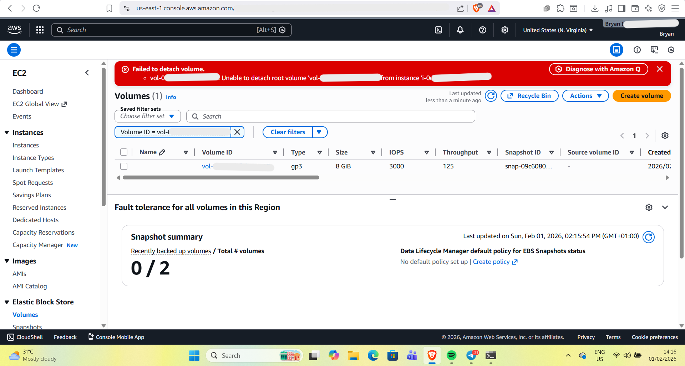 
  <em>Pic 7: Detach failed while instance was running.</em>

  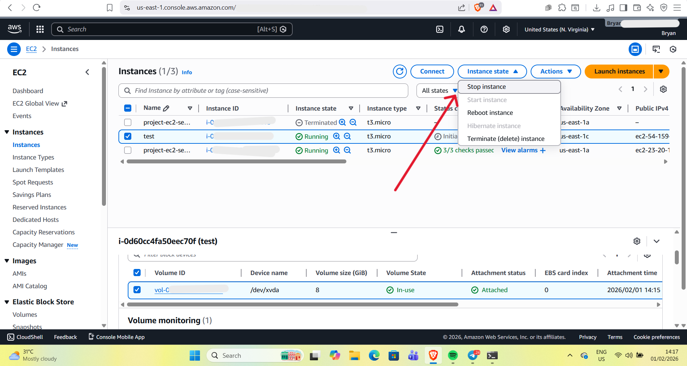 
  <em>Pic 8: Stopping the instance.</em>

  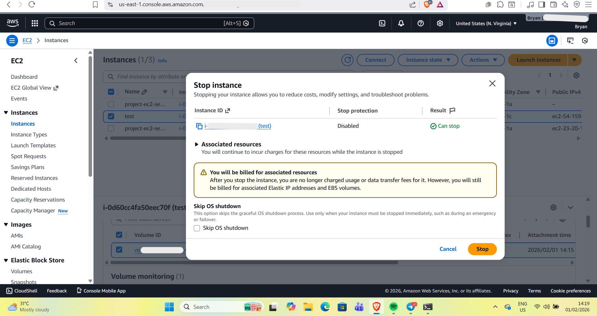 
  <em>Pic 9: Instance successfully stopped.</em>

---

### 8. Delete Empty Volume
- Detached and **deleted the empty volume** to make room for the original EBS volume.

  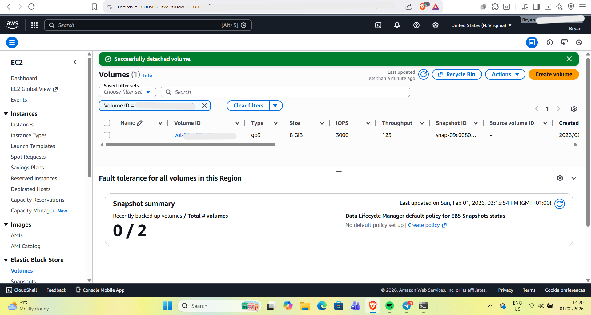 
  <em>Pic 10: Empty volume detached successfully.</em>

  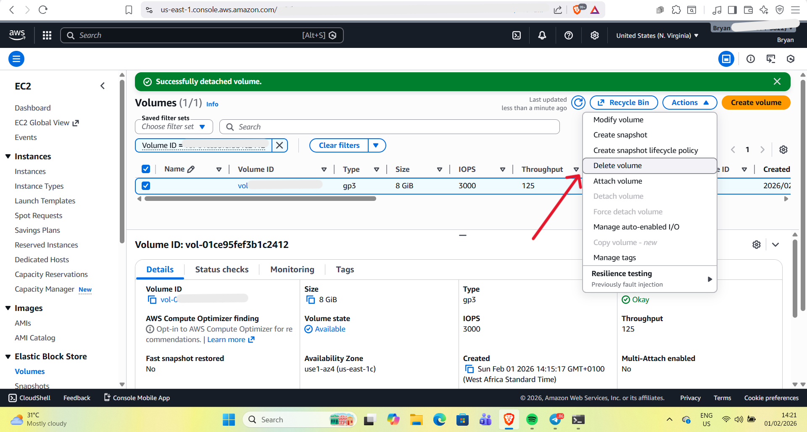 
  <em>Pic 11: Confirmed deletion of empty volume.</em>

  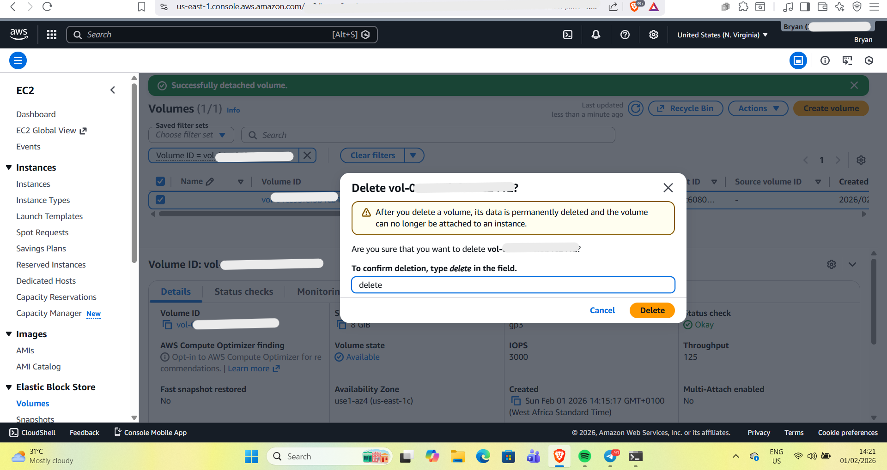 
  <em>Pic 12: Empty volume deleted.</em>

  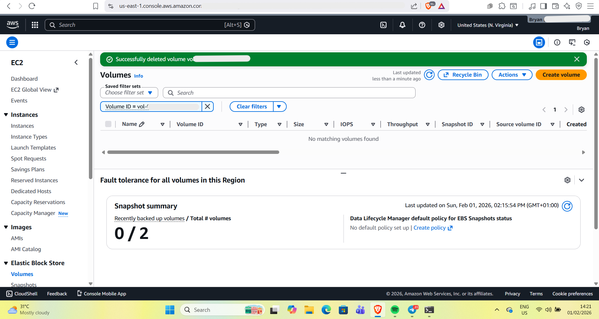 
  <em>Pic 13: Overview of both instances — old locked-out instance and new instance.</em>

---

### 9. Attach Original Volume to New Instance
- Navigated to **EC2 → Volumes**, selected the original unattached volume, and attached it to the new instance.

  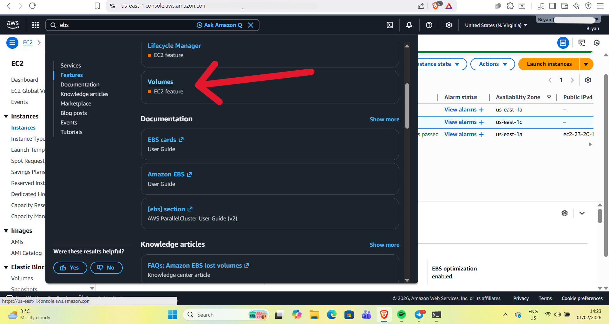 
  <em>Pic 14: Accessed EC2 Volumes dashboard.</em>

  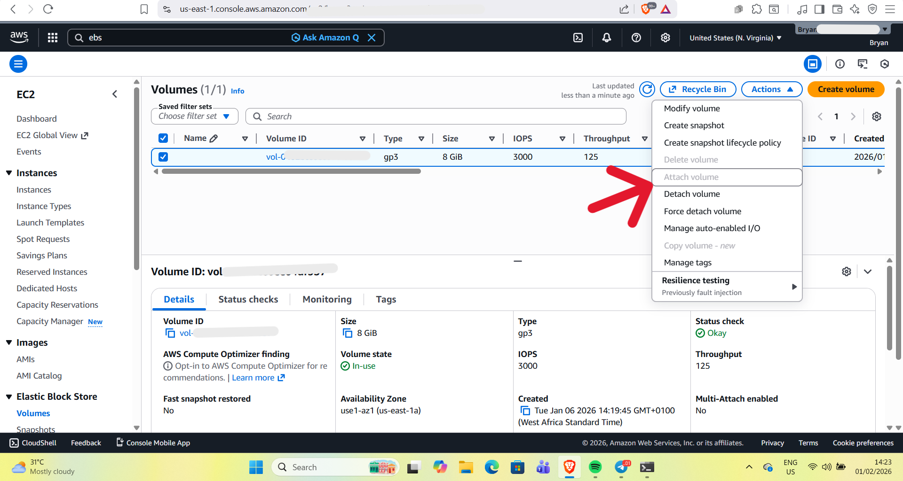 
  <em>Pic 15: Original EBS volume attached to new instance.</em>

---

### 10. Clean Up

#### Pic 16
- Deleted the temporary instances used for reenactment.  
- **Note:** The instance at the bottom (`project-ec2-server`) is the actual instance where recovery occurred, and the one on top (`test`) was created just for reenactment. Both were deleted after completing the process.

  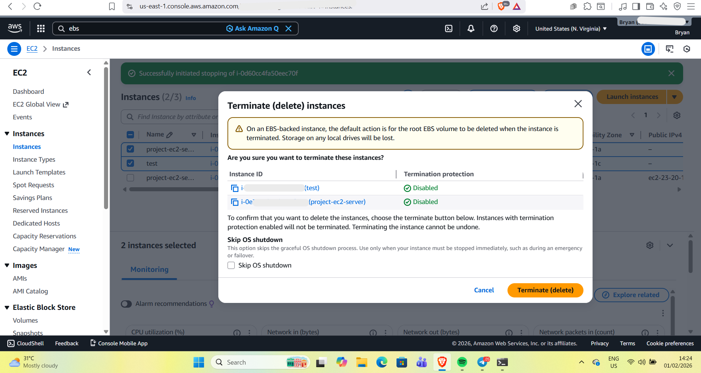 
  <em>Pic 16: Temporary and reenactment instances deleted.</em>

#### Pic 17
- Renamed the new instance to match the original instance name to avoid confusion.  
- Verified access by logging in using **Instance Connect** on the AWS console.

  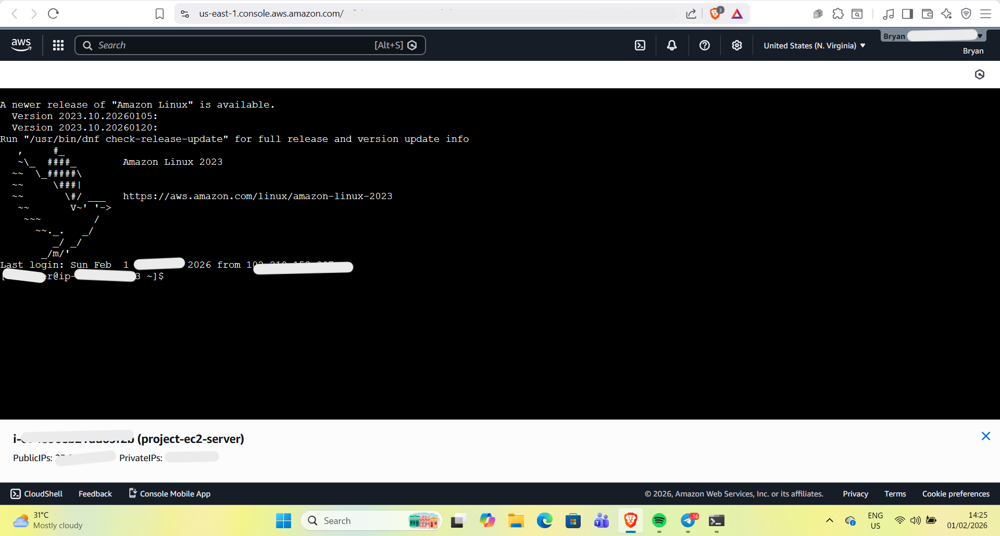 
  <em>Pic 17: Renamed instance and verified access via Instance Connect.</em>

---

### 11. Verify Access

#### Pic 18
- Successfully connected to the restored instance via **SSH** using Ubuntu WSL2.

  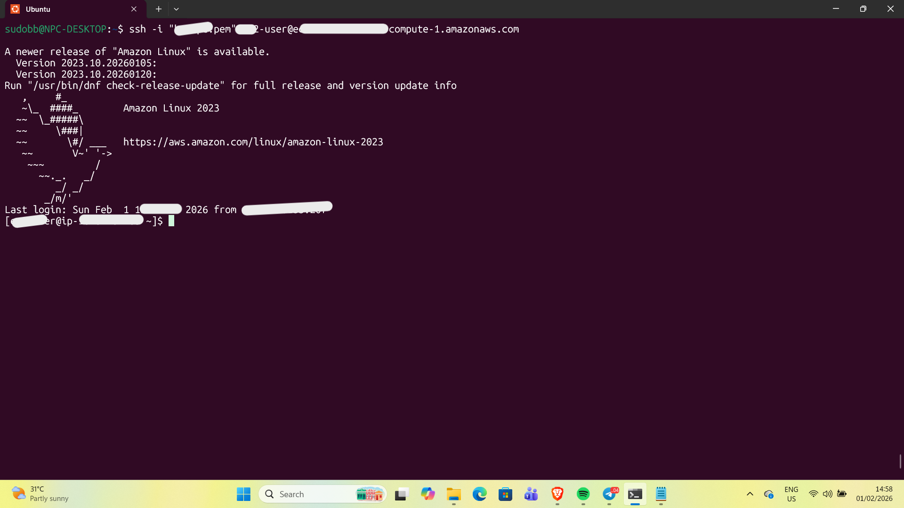 
  <em>Pic 18: SSH login via Ubuntu WSL2 successful.</em>

---

## Lessons Learned

- Always **create a key pair** during EC2 instance launch.  
- Instance Connect can fail unexpectedly; having a backup key pair is critical.  
- Detached EBS volumes can be safely reattached to new instances for recovery.  
- AWS does not allow retroactive key pair application on Amazon Linux instances.

